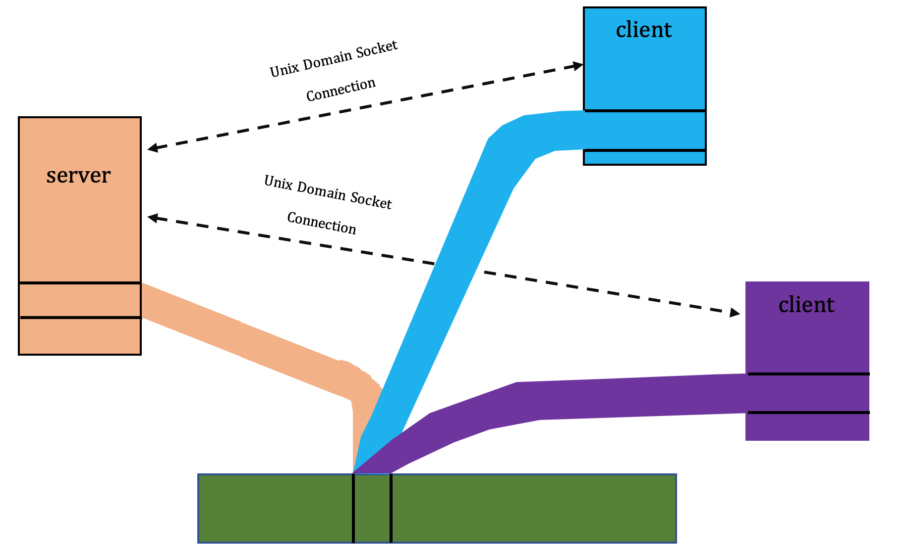

#Hash_Table

The purpose of this project is to implement a simple hash-table using various IPC techniques.

The server process creates/add/delete/update/find and flush the table, and other client processes' hash-table are synchronized with that of server. The approach of table synchronization among server and clients is by using UNIX domain socket and Shared Memory.

* Unix Domain Socket: server informs clients of specified operation(op-code) via socket.
* POSIX Shared Memory: server shares the content with clients via shared memory.

The server receives op-code and data via console in form of following format:

< op-code > < data >

op-code: ADD/DELETE/FIND/SHOW/FLUSH

for example, when the server gets **ADD benyamin** from console, the server parses the input string and figures out that **benyamin** should be added to the local table. After that, the server should inform connected clients of updating their corresponding table thereby adding new item **benyamin**. So, the server sends op-code and a **key** of shared memory region to where it maps **benyamin**. So, the following format is sent via socket to clients:

< loop > < sync_msg > < key >

loop: An integer which indicate that the server wants to keep its connection with corresponding client or wants to disconnect (1 for keep connection and 0 for disconnection).

sync_msg: ADD/DELETE/FIND/SHOW/FLUSH

key: The key for shared memory region. In this implementation, for simplicity, I just assign data to key. ( key = benyamin, although this is quite insane, but work in progress to improve )

On other side, the client receives a control message from server, parses it and figures out that there is a data in a shared memory region with **key** value. So, it collects the data and according to parsed control message, it adds the data to its local table.

Note that, only ADD op-code needs shared memory region, because the table is synchronized at the beginning of running the client.

It is also worth mentioning that while the client only prints data just for demonstration purposes, the concept of data synchronization using IPC mechanisms can easily be extended to real-life systems. 
